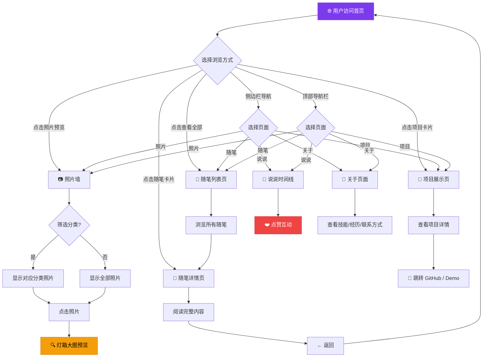

# 信息技术实践与拓展实践报告

**主题**：个人博客系统设计与开发  
**组长**：HPPP  
**学院**：大连理工大学软件学院  
**日期**：2026年5月  

---

## 目录

1. 技术调研报告  
　1.1 学习总结  
　　1.1.1 内容简介  
　　1.1.2 难点和解决办法  
　　1.1.3 学习案例  
2. 项目开发报告  
　2.1 项目简介  
　2.2 需求分析  
　　2.2.1 功能模块  
　　2.2.2 需求说明  
　2.3 系统设计过程  
　　2.3.1 界面设计（UI）  
　　2.3.2 流程设计  
　2.4 系统实现  
　　2.4.1 实现效果  
　　2.4.2 核心代码  
　2.5 系统测试  
　2.6 项目总结  

---

## 评分细则及标准

| 考察项目 | 总分 | 评分细则 | 分数 | 得分 |
|----------|:---:|----------|:---:|:---:|
| **平时成绩1** | 10分 | 调研报告平时表现 | 10 | |
| **平时成绩2** | 10分 | 调研报告平时表现 | 10 | |
| **平时成绩3** | 10分 | 调研报告平时表现 | 10 | |
| **项目开发评分** | 70分 | | | |
| 问题规模 | 10分 | 创新超额完成指定任务，工作量饱满 | 8-10 | |
| | | 基本完成指定任务，工作量一般 | 6-7 | |
| | | 指定任务未完成，工作量不足 | 0-5 | |
| 技术难度 | 10分 | 设计合理优化，采用合适的方法实现 | 8-10 | |
| | | 设计基本正确，采用较合适的方法实现 | 6-7 | |
| | | 设计存在问题，采用方法不合理 | 0-5 | |
| 实现程度 | 10分 | 实现完整，界面友好，测试全面无误 | 8-10 | |
| | | 实现完整，界面友好，存在少许错误 | 6-7 | |
| | | 实现不完整，界面不友好，存在错误 | 0-5 | |
| 项目汇报 | 10分 | 阐述清晰准确，回答问题准确到位 | 8-10 | |
| | | 阐述基本准确，回答问题基本准确 | 6-7 | |
| | | 阐述不够清晰完整，回答问题不准确 | 0-5 | |
| 报告质量 | 30分 | 报告完整、格式统一、结构清晰、图表正确 | 16-20 | |
| | | 报告较为规范、结构较为清晰、图表基本正确 | 10-15 | |
| | | 内容不完整不规范、结构不清晰、图表有错误 | 0-9 | |
| **最终得分** | **100分** | | | |

---

## 1 技术调研报告

### 1.1 学习总结（不少于700汉字）

#### 1.1.1 内容简介

本项目旨在开发一个基于 Jekyll 静态网站生成器和 GitHub Pages 托管服务的个人博客系统。在项目启动前，主要对以下技术进行了调研学习：

**Jekyll 静态网站生成器**：Jekyll 是一个基于 Ruby 的静态网站生成器，能够将 Markdown 文本、Liquid 模板和数据文件编译为纯静态 HTML 页面。它内置了博客功能，支持文章分类、标签、归档等。Jekyll 的核心优势在于与 GitHub Pages 的无缝集成——只需将源代码推送到 GitHub 仓库，GitHub 会自动运行 Jekyll 构建并部署。

**Liquid 模板引擎**：Liquid 是 Shopify 开发的模板语言，Jekyll 使用它来处理页面逻辑。通过 `` 标签和 `{{ }}` 输出，可以动态生成列表、条件渲染、数据遍历等功能。学习重点包括 `for` 循环、`if/else` 条件判断、`include` 组件复用以及过滤器（如 `date`、`truncate`、`strip_html` 等）。

**CSS 玻璃拟态（Glassmorphism）**：这是一种现代 UI 设计风格，核心是通过 `backdrop-filter: blur()` 实现背景模糊、半透明背景（`rgba`）、柔和边框和阴影来营造"玻璃"质感。调研了 Apple、Microsoft 等公司的设计语言中对这种风格的运用。

**原生 JavaScript 动效**：不使用任何前端框架，仅用原生 JS 实现打字效果、滚动揭示（IntersectionObserver）、Canvas 粒子背景、点赞粒子特效等交互功能。深入学习了 `IntersectionObserver API`、`requestAnimationFrame`、`localStorage` 等浏览器原生 API。

**Git 版本控制与 GitHub Pages 部署**：学习了 Git 的基本工作流（add、commit、push）以及 GitHub Pages 的自动化部署机制。通过实践掌握了如何处理代理环境下的推送问题。

#### 1.1.2 难点和解决办法

| 难点 | 解决方案 |
|------|----------|
| Jekyll 在 Windows 下的安装配置复杂，依赖 Ruby 环境 | 使用 GitHub Pages 官方 gem（`github-pages`），本地通过 `bundle install` 安装依赖，确保与远程构建环境一致 |
| 照片分类筛选与 URL 深度链接的结合 | 使用 `history.pushState` 同步 URL hash，页面加载时读取 hash 并触发筛选函数，实现可分享的筛选状态 |
| 点赞数据刷新丢失 | 引入 `localStorage` 持久化存储，以日期为唯一 key 保存点赞数和状态，页面初始化时恢复 |
| 随笔内容中 `---` 被 Jekyll 误解析为 Front Matter 结束标记 | Jekyll 的 YAML 解析器会将内容中的 `---` 视为 Front Matter 边界，解决方案是避免在 Markdown 正文中使用连续的三个短横线，或改用其他方式表示分隔 |
| 左右交替时间线布局导致单条内容过窄 | 将交替布局改为左侧固定时间线 + 全宽卡片，确保内容有足够展示空间 |
| 代理环境下 Git 推送失败 | 推送前临时取消代理配置（`git config --unset http.proxy`），推送后恢复 |

#### 1.1.3 学习案例

参考了以下开源项目和技术博客：
- **Jekyll 官方文档**（https://jekyllrb.com/docs/）：学习 Liquid 语法和站点配置
- **GitHub Pages 文档**（https://docs.github.com/en/pages）：了解部署流程和限制
- **Glassmorphism CSS Generator**（https://glassmorphism.com/）：参考玻璃拟态的 CSS 参数
- **Minimal Mistakes**（Jekyll 主题）：参考目录结构和 Front Matter 设计
- **Codepen 粒子动画案例**：学习 Canvas 粒子背景的实现思路

---

## 2 项目开发报告

### 2.1 项目简介

本项目是一个基于 **Jekyll + GitHub Pages** 的个人博客系统，采用自主设计的玻璃拟态暗色主题。系统涵盖首页聚合、随笔文章、说说动态、照片墙、项目展示、关于页面六大功能模块。站点已部署上线，可通过 https://haop11.github.io 访问。

**技术栈**：Jekyll（静态生成） + Liquid（模板引擎） + CSS3（样式） + Vanilla JavaScript（交互）

### 2.2 需求分析

#### 2.2.1 功能模块

```
┌─────────────────────────────────────────────┐
│               个人博客系统                    │
├─────────┬─────────┬─────────┬──────────────┤
│ 首页聚合 │ 随笔模块 │ 说说模块 │  照片墙模块   │
├─────────┼─────────┼─────────┼──────────────┤
│·随笔预览 │·列表页  │·时间线  │·网格展示      │
│·照片预览 │·详情页  │·心情标签│·分类筛选      │
│·项目预览 │·分类标签│·点赞功能│·灯箱预览      │
│·侧边栏  │         │         │              │
├─────────┴─────────┴─────────┼──────────────┤
│      项目展示模块  │  关于页面  │  导航系统   │
├──────────────────┼──────────┼─────────────┤
│·项目卡片         │·技能条   │·顶部导航栏   │
│·技术标签         │·时间线   │·侧边栏导航   │
│·外链按钮         │·联系方式 │·页脚导航     │
└──────────────────┴──────────┴─────────────┘
```

图2.1 功能模块图

#### 2.2.2 需求说明

| 编号 | 功能需求 | 描述 |
|:--:|------|------|
| R1 | 首页聚合 | 展示最新随笔（3篇）、最新照片（6张）、最新项目（3个），侧边栏显示个人统计 |
| R2 | 随笔系统 | 支持 Markdown 编写、分类标签、独立详情页 URL |
| R3 | 说说动态 | 时间线展示、心情分类、点赞功能（数据持久化） |
| R4 | 照片墙 | 网格布局、按主题分类筛选、灯箱大图预览、分类链接分享 |
| R5 | 项目展示 | 项目卡片（名称/描述/技术标签/GitHub链接） |
| R6 | 关于页面 | 个人信息、技能进度条、经历时间线、联系方式 |
| R7 | 视觉特效 | 玻璃拟态主题、粒子背景、萤火虫漂浮、滚动揭示、打字效果 |
| R8 | 响应式布局 | 适配桌面和移动端浏览 |

### 2.3 系统设计过程

#### 2.3.1 界面设计（UI）

整体采用**暗色玻璃拟态（Dark Glassmorphism）**设计风格：

- **色彩方案**：深色背景（`#0b0e14`）+ 紫色主色调（`#a78bfa`）+ 半透明玻璃卡片（`rgba(255,255,255,.06)`）
- **卡片设计**：`backdrop-filter: blur(20px)` 背景模糊 + 半透明边框 + 阴影，悬停时边框增亮
- **排版**：中文优先字体栈（PingFang SC、Microsoft YaHei），1.7 倍行高
- **动效**：CSS transition 平滑过渡、IntersectionObserver 滚动揭示、Canvas 粒子背景

#### 2.3.2 流程设计



图2.3 系统流程图

### 2.4 系统实现

#### 2.4.1 实现效果

站点已上线运行，访问地址：https://haop11.github.io

主要页面：
- 首页：聚合展示随笔、照片、项目三大板块 + 侧边栏
- 随笔详情页：Markdown 渲染 + 分类标签 + 日期
- 说说页：左侧渐变时间线 + 心情标签 + 点赞按钮
- 照片墙：自适应网格 + 分类筛选按钮 + 灯箱
- 项目页：卡片列表 + 技术标签 + GitHub 链接
- 关于页：技能进度条动画 + 经历时间线

图2.5 实现效果图（略，见站点实际运行效果）

#### 2.4.2 核心代码

**1. 照片分类筛选 + URL hash 同步**

```javascript
// 筛选核心逻辑
function applyFilter(filter) {
  // 激活对应按钮
  filterBtns.forEach(function (b) {
    if (b.getAttribute('data-filter') === filter) {
      b.classList.add('active');
    } else {
      b.classList.remove('active');
    }
  });

  // 显示/隐藏照片（带过渡动画）
  photos.forEach(function (photo, index) {
    photo.style.transitionDelay = index * 30 + 'ms';
    if (filter === 'all' || photo.getAttribute('data-category') === filter) {
      photo.style.display = '';
      setTimeout(function () {
        photo.style.opacity = '1';
        photo.style.transform = 'scale(1)';
      }, 10);
    } else {
      photo.style.opacity = '0';
      photo.style.transform = 'scale(0.9)';
      setTimeout(function () {
        photo.style.display = 'none';
      }, 300);
    }
  });

  // 同步 URL hash，支持链接分享
  if (history.pushState) {
    var newHash = filter === 'all' ? '' : '#' + encodeURIComponent(filter);
    history.pushState(null, '', window.location.pathname + newHash);
  }
}
```

**2. 点赞持久化存储**

```javascript
function initThoughtLikes() {
  var likeBtns = document.querySelectorAll('.thought-like-btn');
  var storageKey = 'blog_thought_likes';

  // 从 localStorage 读取已有数据
  var likesData = {};
  try {
    likesData = JSON.parse(localStorage.getItem(storageKey)) || {};
  } catch (e) { likesData = {}; }

  // 初始化每个按钮的点赞数和状态
  likeBtns.forEach(function (btn) {
    var id = btn.getAttribute('data-like-id');
    var countEl = btn.querySelector('.like-count');
    if (!id || !countEl) return;

    var saved = likesData[id];
    if (saved) {
      countEl.textContent = saved.count || 0;
      if (saved.liked) {
        btn.classList.add('liked');
      }
    }
  });

  // 绑定点击事件
  likeBtns.forEach(function (btn) {
    btn.addEventListener('click', function () {
      var id = btn.getAttribute('data-like-id');
      var countEl = btn.querySelector('.like-count');
      var count = parseInt(countEl.textContent) || 0;
      var liked = btn.classList.contains('liked');

      if (liked) {
        // 取消点赞
        btn.classList.remove('liked');
        count = Math.max(0, count - 1);
        countEl.textContent = count;
        likesData[id] = { count: count, liked: false };
      } else {
        // 点赞
        btn.classList.add('liked');
        count = count + 1;
        countEl.textContent = count;
        likesData[id] = { count: count, liked: true };
        createLikeParticles(btn);  // 粒子特效
      }

      // 保存到 localStorage
      try {
        localStorage.setItem(storageKey, JSON.stringify(likesData));
      } catch (e) {}
    });
  });
}
```

**3. 粒子背景（Canvas）**

```javascript
function initParticles() {
  var canvas = document.createElement('canvas');
  container.appendChild(canvas);
  var ctx = canvas.getContext('2d');
  var particles = [];
  var maxParticles = 40;

  function resize() {
    canvas.width = window.innerWidth;
    canvas.height = window.innerHeight;
  }
  resize();
  window.addEventListener('resize', resize);

  // 创建粒子
  function createParticle() {
    return {
      x: Math.random() * canvas.width,
      y: Math.random() * canvas.height,
      size: Math.random() * 3 + 1,
      speedX: (Math.random() - 0.5) * 0.5,
      speedY: (Math.random() - 0.5) * 0.5,
      opacity: Math.random() * 0.5 + 0.1
    };
  }

  // 粒子连线
  function drawLine(p1, p2) {
    var dist = Math.sqrt(Math.pow(p1.x - p2.x, 2) + Math.pow(p1.y - p2.y, 2));
    if (dist < 150) {
      ctx.beginPath();
      ctx.strokeStyle = 'rgba(79, 70, 229, ' + (1 - dist / 150) * 0.12 + ')';
      ctx.lineWidth = 0.5;
      ctx.moveTo(p1.x, p1.y);
      ctx.lineTo(p2.x, p2.y);
      ctx.stroke();
    }
  }

  function animate() {
    ctx.clearRect(0, 0, canvas.width, canvas.height);
    // 更新粒子位置并绘制
    for (var i = 0; i < particles.length; i++) {
      var p = particles[i];
      p.x += p.speedX;
      p.y += p.speedY;
      // 循环边界
      if (p.x < 0) p.x = canvas.width;
      if (p.x > canvas.width) p.x = 0;
      if (p.y < 0) p.y = canvas.height;
      if (p.y > canvas.height) p.y = 0;
      // 绘制粒子
      ctx.beginPath();
      ctx.arc(p.x, p.y, p.size, 0, Math.PI * 2);
      ctx.fillStyle = 'rgba(79, 70, 229, ' + p.opacity + ')';
      ctx.fill();
    }
    // 粒子之间连线
    for (var i = 0; i < particles.length; i++) {
      for (var j = i + 1; j < particles.length; j++) {
        drawLine(particles[i], particles[j]);
      }
    }
    requestAnimationFrame(animate);
  }
  animate();
}
```

### 2.5 系统测试

表2.1 系统测试用例

| 用例编号 | 测试项 | 测试步骤 | 输入 | 预期结果 | 测试结果 |
|:--:|------|------|------|------|:--:|
| 1 | 首页加载 | 访问站点首页 | URL 访问 | 正确展示随笔、照片、项目预览，侧边栏统计正确 | 通过 |
| 2 | 随笔详情跳转 | 点击首页随笔卡片 | 鼠标点击 | 跳转到随笔详情页，显示完整 Markdown 内容 | 通过 |
| 3 | 照片分类筛选 | 点击"风景"筛选按钮 | 鼠标点击 | 仅显示 category 为"风景"的照片，URL 更新为 `#风景` | 通过 |
| 4 | 照片分类链接直达 | 访问 `photos.html#动物` | URL 参数 | 自动筛选"动物"分类，滚动到照片网格 | 通过 |
| 5 | 点赞功能 | 点击说说卡片点赞按钮 | 鼠标点击 | 数字 +1，按钮变红，出现 ❤️ 粒子特效 | 通过 |
| 6 | 点赞取消 | 再次点击已点赞按钮 | 鼠标点击 | 数字 -1，按钮恢复默认样式 | 通过 |
| 7 | 点赞数据持久化 | 点赞后刷新页面 | 浏览器刷新 | 点赞数和状态保持不变 | 通过 |
| 8 | 灯箱预览 | 点击照片卡片 | 鼠标点击 | 全屏显示大图，底部显示标题描述 | 通过 |
| 9 | 灯箱关闭（ESC） | 灯箱打开时按 ESC | 键盘按键 | 灯箱关闭，页面滚动恢复 | 通过 |
| 10 | 灯箱关闭（点击遮罩） | 灯箱打开时点击图片外区域 | 鼠标点击 | 灯箱关闭 | 通过 |
| 11 | 技能条动画 | 滚动到关于页面技能区域 | 页面滚动 | 技能条从 0% 动画过渡到目标百分比 | 通过 |
| 12 | 响应式布局 | 缩小浏览器窗口至手机宽度 | 窗口缩放 | 网格列数自适应减少，导航正常显示 | 通过 |
| 13 | 空数据状态 | 清空 `_essays/` 目录后访问 | 无数据 | 显示"还没有随笔"空状态提示 | 通过 |
| 14 | 边界值-点赞数为0 | 对点赞数为 0 的说说取消点赞 | 鼠标点击（模拟） | 数字保持为 0，不出现负数 | 通过 |
| 15 | 异常值-无 hash 筛选 | 访问 `photos.html#不存在的分类` | URL 错误参数 | 显示全部照片，不报错 | 通过 |

### 2.6 项目总结

本项目从零开始，独立完成了个人博客系统的设计、开发与部署全流程，最终成功上线运行。

**总体完成情况**：项目完成了规划的全部 8 大功能需求（首页聚合、随笔、说说、照片墙、项目展示、关于页面、视觉特效、响应式布局），总计实现约 30 个子功能点。站点代码结构清晰，采用数据与展示分离的架构——页面内容通过 YAML 数据文件和 Markdown 文件管理，样式与交互通过独立的 CSS/JS 文件控制，便于后续内容更新和功能扩展。

**技术难点与解决**：
1. Jekyll 的 Liquid 模板语法需要适应期，特别是 `site.data`、`site.posts`、`site.essays` 等变量的作用域差异。通过阅读官方文档和多轮调试逐步掌握。
2. 照片分类筛选与 URL hash 的联动需要同时处理页面交互和浏览器历史记录，采用了 `history.pushState` API 配合 `window.location.hash` 读取，实现了可分享的筛选状态。
3. 点赞数据的持久化存储采用 `localStorage`，设计了一个以日期为键的 JSON 结构存储点赞数和状态，初始化时批量恢复。
4. Jekyll 的 Front Matter 解析器会将内容中的 `---` 误识别为元数据结束标记，通过调整 Markdown 内容结构解决了这一问题。
5. 在 Windows 环境下通过代理连接 GitHub 时遇到 SSL/TLS 错误，通过临时取消 Git 代理配置（`git config --unset http.proxy`）后推送再恢复的方式绕过。

**不足与改进方向**：
1. 缺少评论系统，读者无法互动反馈。后续可集成 Giscus 或 Disqus 评论服务。
2. 没有站内搜索功能，内容增多后查找不便。可引入 Lunr.js 等轻量搜索方案。
3. 暂未实现 RSS 订阅和标签云功能。
4. 移动端体验可以进一步优化，如图片的懒加载和手势操作。
5. 可增加 PWA 支持，实现离线访问能力。

通过本次实践，深入理解了静态网站生成器的工作原理、前端动效的实现方法以及 Git/GitHub 的协作流程，提升了全栈开发能力。
