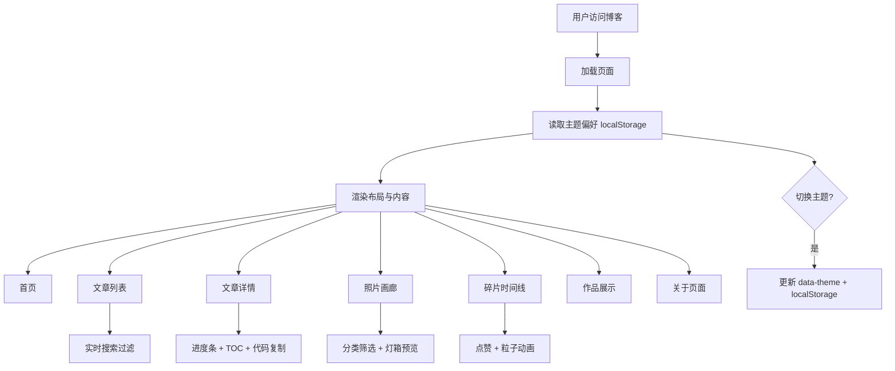

# 视频讲解稿：个人博客系统项目展示

## 预计时长：4 分 30 秒

## 系统流程图

---

### 开场（0:00 - 0:15）

大家好，我是XX。本次信息技术实践课程我完成的项目是一个基于 Jekyll 和 GitHub Pages 的个人博客系统，名字叫做「拾光集」。接下来我将为大家展示项目的功能和实现过程。

---

### 项目概述（0:15 - 0:45）

这个博客包含了六个主要模块：首页聚合、文章列表、照片画廊、碎片时间线、作品展示和关于页面。整个项目使用原生的 HTML、CSS 和 JavaScript 开发，不依赖任何第三方框架，通过 GitHub Pages 免费部署上线。

现在我来演示一下网站的实际效果。

---

### 功能演示（0:45 - 2:45）

**【首页】** 打开首页，可以看到网站的名称和简介，以及四项统计数据。往下滚动，依次展示最新文章、最新照片、最新碎片和作品预览。每个区块都有「查看全部」的链接。

**【文章列表】** 点击侧边栏的「文章」进入文章列表页。这里整合了博客文章和随笔，按时间倒序排列。每篇文章卡片显示了分类标签、发布日期、预估阅读时长和摘要。顶部的搜索框可以实时过滤文章——比如我输入「Python」，就只显示包含这个关键词的文章。

**【文章详情】** 点开一篇文章。可以看到顶部的阅读进度条随着滚动同步前进。右侧是自动生成的文章目录，点击可以快速跳转到对应章节。鼠标悬停在代码块上会出现「复制」按钮，点击就能一键复制代码。

**【暗色模式】** 点击侧边栏底部的「切换主题」按钮，整个网站会平滑过渡到暗色模式。这个偏好会被浏览器记住，刷新后依然保持。

**【照片画廊】** 画廊页采用瀑布流布局展示照片，可以通过顶部的分类按钮筛选不同类型的照片。点击任意照片会弹出灯箱，可以全屏查看。

**【碎片时间线】** 碎片页以时间线的形式展示短内容。每条碎片可以点赞，点击爱心的时侯会触发粒子飘散动画。点赞数据会保存在本地，不会丢失。

**【作品展示】** 作品页以卡片形式展示项目，包含技术标签和跳转链接。

**【响应式布局】** 最后看一下响应式效果。当我缩小窗口到手机宽度时，侧边栏自动收缩为顶部导航栏，照片画廊从三列变为单列，文章的目录也会自动隐藏。

---

### 技术亮点（2:45 - 3:30）

项目的技术亮点主要有四个：

第一，**CSS 自定义属性实现主题切换**。所有的颜色值都抽象为 CSS 变量，通过切换 html 元素的 data-theme 属性，在亮色和暗色两套色板之间一键切换。

第二，**Intersection Observer 实现目录滚动监听**。文章目录不是静态的，而是通过监听所有标题元素的可见性，实时高亮当前正在阅读的章节。

第三，**静态网站的客户端搜索**。虽然是纯静态网站，但通过在页面加载时为每篇文章生成搜索索引，用户在输入时实时进行字符串匹配过滤。

第四，**localStorage 实现数据持久化**。主题偏好和碎片点赞数据都存储在浏览器本地，不需要后端数据库。

---

### 难点与收获（3:30 - 4:15）

在开发过程中遇到的主要难点有：

一个是对 Jekyll 和 Liquid 模板语法不熟悉，特别是混合编写 HTML 和模板标签时很容易出错。解决方法是仔细阅读官方文档，通过反复调试来加深理解。

另一个是 GitHub Pages 的部署配置比较绕，baseurl 的设置要根据仓库类型来调整。项目站点和用户站点的配置方式不同，踩过坑之后才真正搞明白。

通过这个项目，我最大的收获是完整地走了一遍从设计到上线的工作流程，对前端技术有了系统性的理解，也学会了用 Git 管理代码版本。

---

### 结语（4:15 - 4:30）

以上就是我的项目展示。这个博客我会持续更新和维护，欢迎大家访问和交流。谢谢大家！

---

### 录制提示

- 建议使用浏览器无痕窗口录制，避免书签栏和个人信息泄露
- 提前准备好各页面，确保加载流畅
- 演示暗色模式时注意画面曝光
- 语速适中，每页停留 5-10 秒给观众看清
- 总时长控制在 4 分半到 5 分钟之间
